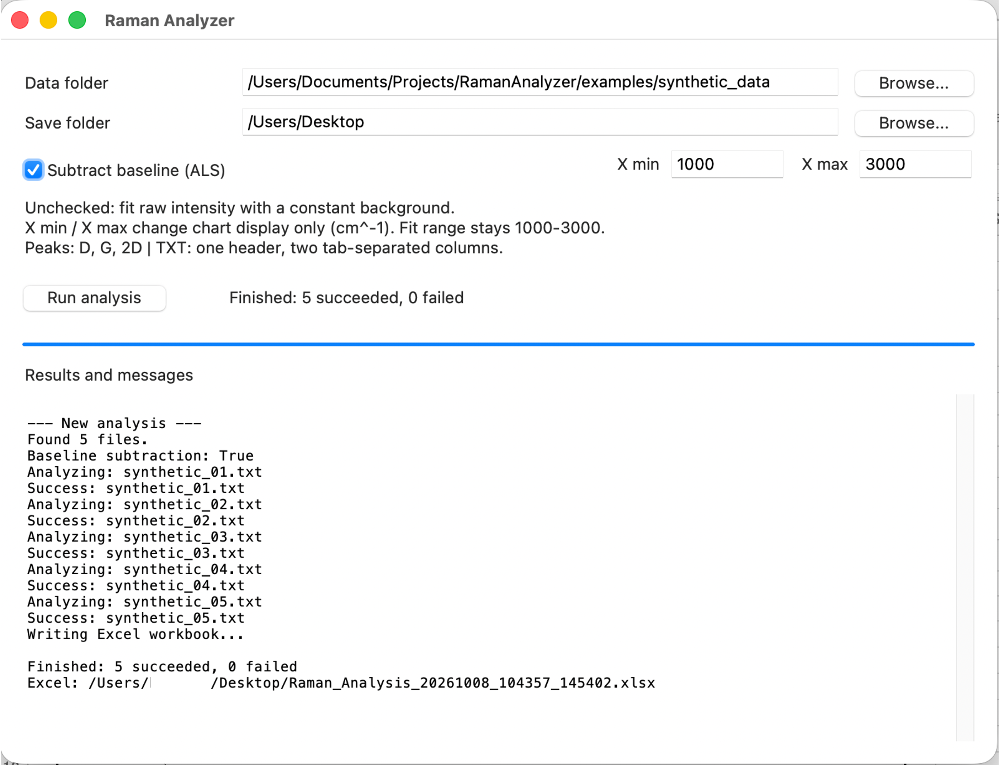
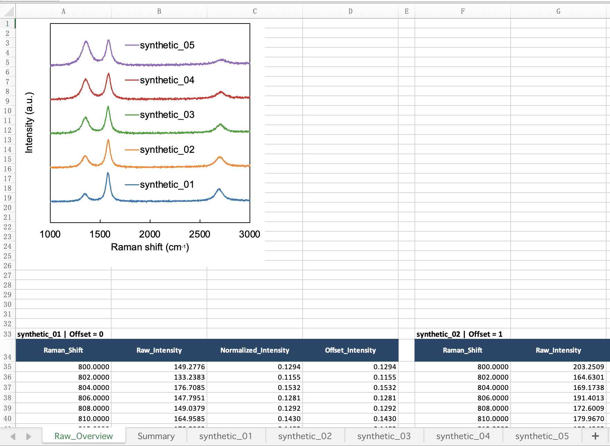
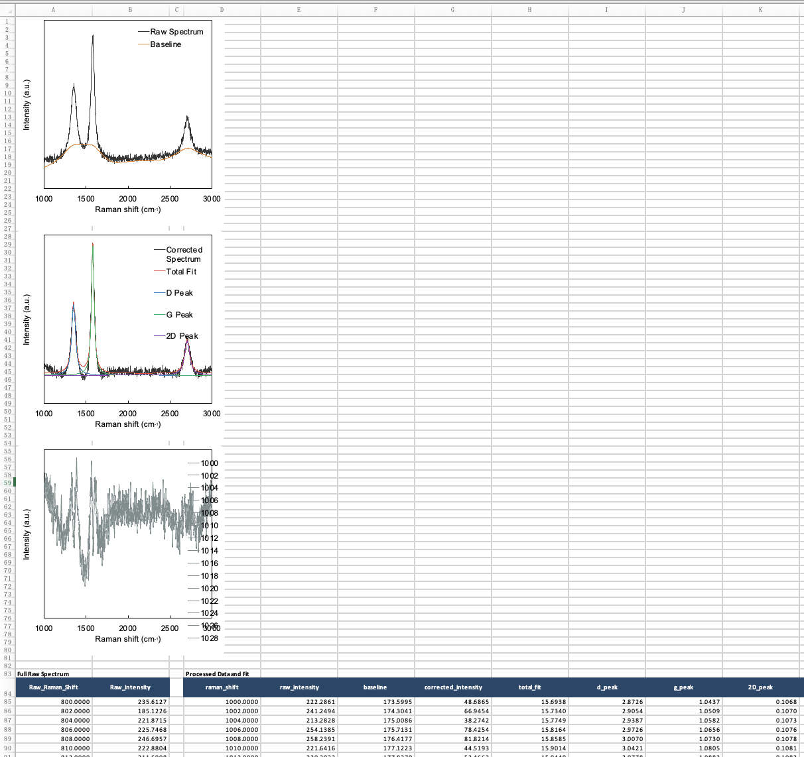
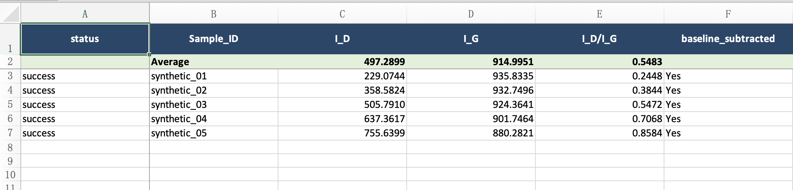

# Raman Analyzer

A desktop application for processing Raman spectra, fitting the D, G, and 2D
bands, and exporting an editable Excel report.

The tool was created to make a repetitive experimental-data workflow faster and
more reproducible. It accepts a folder of spectra, applies optional ALS baseline
correction, performs constrained Lorentzian fitting, and writes the numerical
results, source data, fitted curves, and editable charts into one workbook.

## Screenshots

### Desktop interface



### Editable spectra overview



### Peak fitting results



### Analysis summary



## Features

- Simple desktop interface built with Tkinter
- Folder-based processing of multiple TXT spectra
- Optional asymmetric least-squares (ALS) baseline correction
- Constrained Lorentzian fitting of D, G, and 2D bands
- Calculation of peak height, position, FWHM, area, `I_D/I_G`, and fit RMSE
- Configurable horizontal display range for Excel charts
- One editable Excel workbook per run
- Overview chart with normalized, vertically offset spectra
- Individual worksheets containing raw data, fitted components, and residuals
- Per-file success/failure reporting
- Automatic opening of the completed workbook

## Input format

Each `.txt` file must contain:

1. One header line
2. Two tab-separated columns: Raman shift and intensity

Only TXT files directly inside the selected data folder are processed.

## Quick demonstration

The repository includes five reproducible synthetic spectra in
`examples/synthetic_data`. They are artificial demonstration data, not
experimental measurements. Select that folder in the desktop interface to test
the complete workflow without using private research data.

The files can be regenerated with:

```bash
python examples/generate_synthetic_data.py
```

## Installation

Python 3.11 or newer is recommended.

### Windows application (no Python required)

Open the latest successful **Build Windows app** run on the repository's
**Actions** page and download the `RamanAnalyzer-Windows` artifact. Extract the
downloaded ZIP file, keep all extracted files together, and double-click
`RamanAnalyzer.exe`.

The packaged application includes the synthetic demonstration spectra. The
first launch may show a Windows security warning because this personal project
is not code-signed.

### Run from source

```bash
git clone https://github.com/bieyige0808-design/raman-analyzer.git
cd raman-analyzer
python3 -m venv .venv
source .venv/bin/activate
python -m pip install -r requirements.txt
```

On Windows, activate the environment with:

```powershell
.venv\Scripts\activate
```

## Run the desktop application

```bash
python raman_gui.py
```

Then select the data folder and save folder, choose whether to subtract the
baseline, set the chart limits, and click **Run analysis**.

## Command-line use

```bash
python raman_batch.py --input-dir "/path/to/spectra" --excel-dir "/path/to/results"
```

## Analysis notes

- The fitting interval is fixed at 1000–3000 cm⁻¹.
- The GUI X-min and X-max settings change the Excel chart display range only.
- `I_D` and `I_G` are fitted Lorentzian peak heights.
- `I_D/I_G` is the peak-height ratio; the area ratio is reported separately.
- No smoothing is applied.
- Numerical convergence does not by itself establish scientific validity.
  Baselines, fitted curves, and residuals should always be inspected.

## Project structure

```text
raman-analyzer/
├── raman_gui.py          # Desktop interface
├── raman_batch.py        # Data processing, fitting, and Excel export
├── chart_textbox.py      # Editable ID/IG annotation in the Excel chart
├── RamanAnalyzer.spec    # Windows packaging configuration
├── .github/workflows/    # Automated Windows build
├── examples/             # Reproducible synthetic demonstration spectra
├── requirements.txt      # Python dependencies
└── RUN_INSTRUCTIONS.txt  # Additional operating notes
```

## Scope

This is a personal research workflow tool rather than general-purpose
spectroscopy software. Peak bounds and input assumptions reflect the dataset for
which it was developed and should be reviewed before use with other materials.

Developed with AI assistance. The author defined the scientific requirements,
workflow, experimental-data testing, and output specifications.

## License

This project is released under the MIT License.
